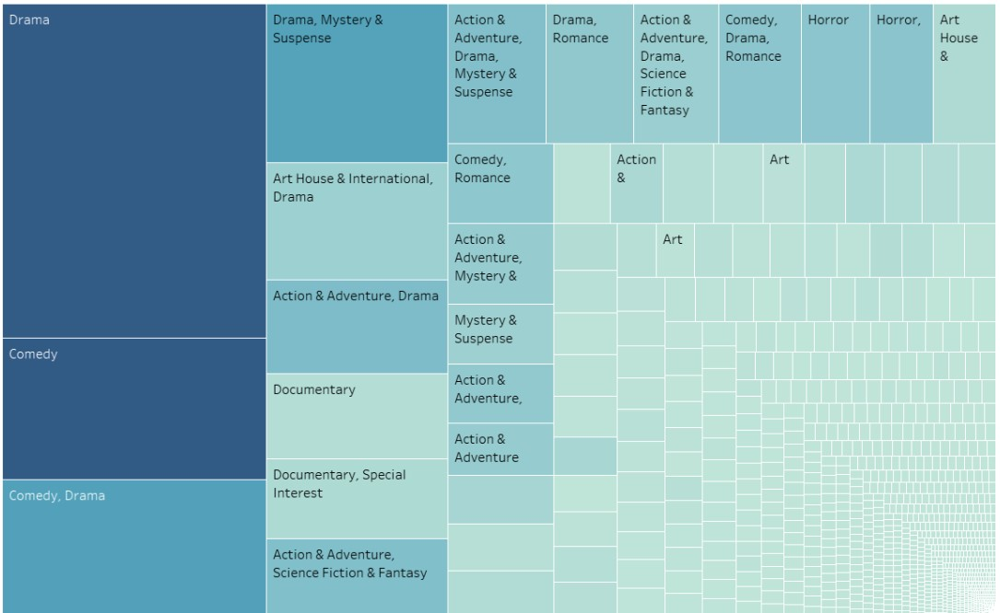
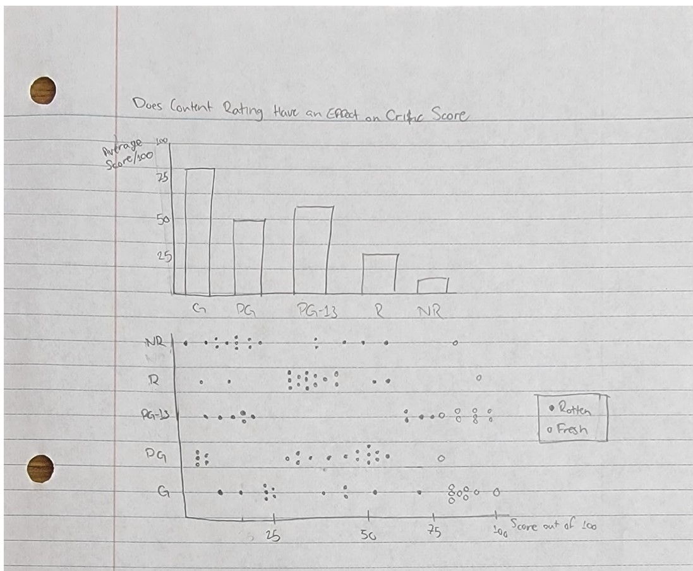
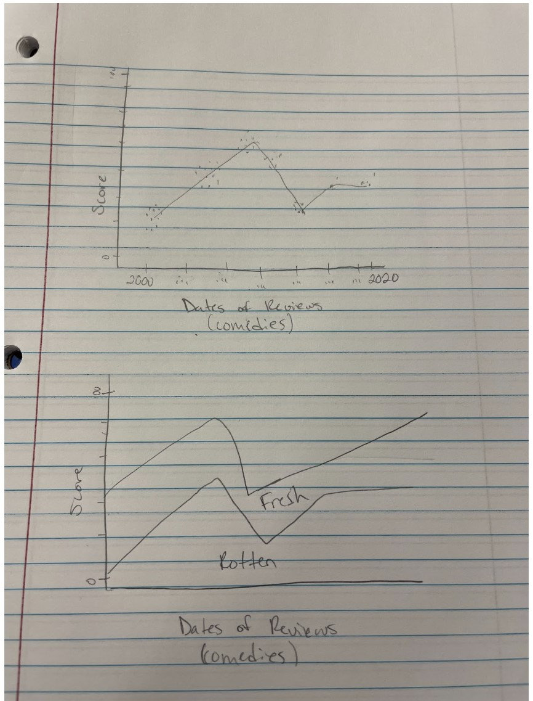
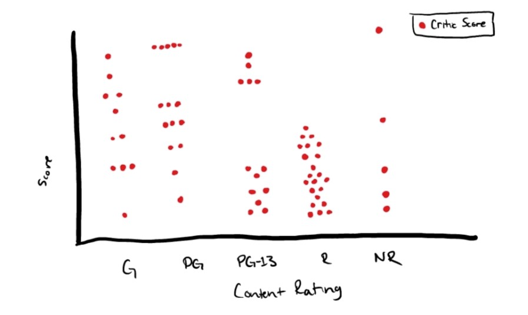
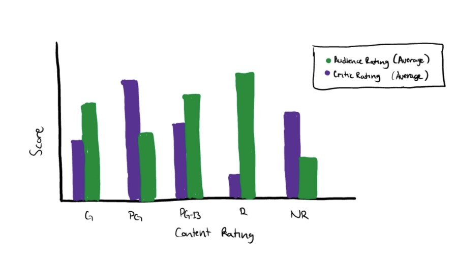
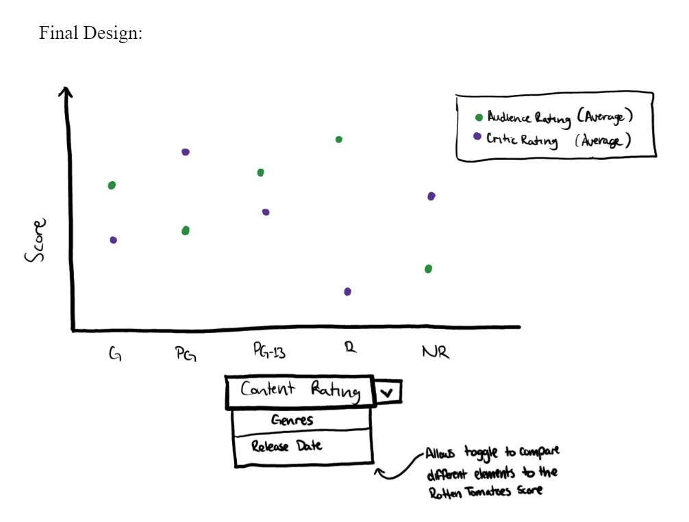
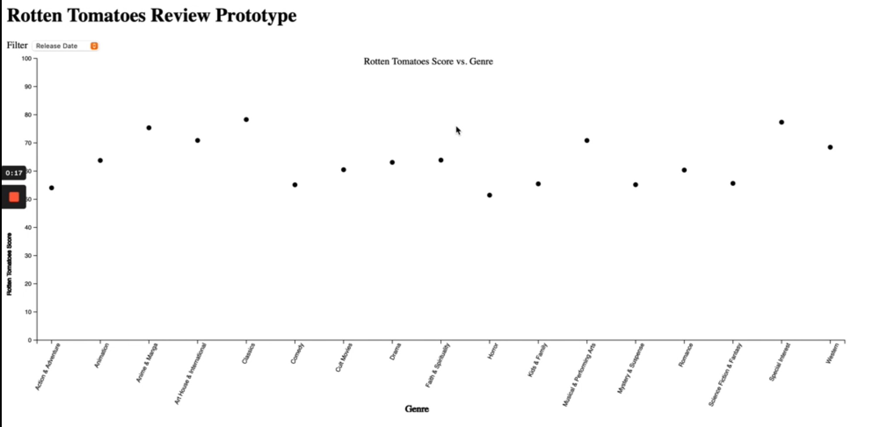
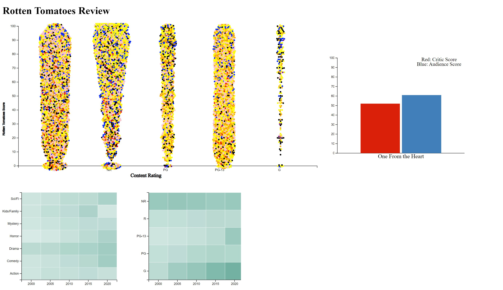

# Rotten Tomatoes Journal

## 09/25/2022
We explored using a few different data sets:

[Food prices in the US](https://www.kaggle.com/datasets/csafrit2/food-prices-in-us-cities)

Possible questions:
 - How have food deserts shifted over time?
 - How has the cost of living shifted over time?
 - Which states are the most expensive?
[Spotify top charts](https://www.kaggle.com/datasets/sveta151/spotify-top-chart-songs-2022)

Possible questions:
 - What genres perform the best over time?
 - Which artists perform the best over time? 
 - How common are one hit wonders?
[Youtube videos](https://www.kaggle.com/datasets/advaypatil/youtube-statistics)

Possible questions:
 - How well do videos with different categories perform?
 - What categories receive the most positive comments and sentiment?

## 09/26/2022
We decided to use a set of data that has statistics and attributes of [youtube videos](https://www.kaggle.com/datasets/advaypatil/youtube-statistics). This has two data sets. The first set is data relating to videos. It contains the title, publishing date, views, likes, and keywords associated with the video. The second set has information about comments on each video, linked by a video ID. This set contains sentiment analysis.

One problem we expect to run into with this data set is that it is very small(only about 4 Mb). This may affect what visualizations we are able to do, or lead to weird outliers we may have to deal with

## 9/27/2022
Because of a lot of people using Youtube datasets/visualizations, we decided to change our project’s dataset because we don’t want to create too similar a visualization, and since we had other datasets in mind that we could use

We decided to switch to a [dataset of Rotten Tomatoes](https://www.kaggle.com/datasets/stefanoleone992/rotten-tomatoes-movies-and-critic-reviews-dataset?resource=download) movie reviews

From this dataset we came up with another series of possible questions:
 - What genres perform the best?
 - How do different genres perform over time?
 - How do the audience and critics score compared to one another?
 - Does content rating have an effect on the critic's score?

These questions were all interesting and seemed to hold our attention, but we knew there would be a good bit of calculation considering the 17 thousand data points in our dataset.

## 10/05/2022
We spent a lot of time looking at our dataset and seeing where it fell short. There were certain columns where 15% of the data was not there. We had to take the time to decide whether or not to keep those data points or shrink our dataset.
Once we decided to keep all of the data and exclude missing data from calculations we looked at what type of calculations we needed. We knew that we needed to be able to find averages for genres ratings, genre ratings over time, audience review scores, and critic review scores. Luckily d3 has a mean function that ignores undefined values.
We then moved on into deciding how to structure our code. We talked through having one working script or having separate. We ended up deciding on separate script files so we could work at the same time and not interfere with one another's code.

## 10/15/2022
We started working on what our final design looked like, we ended up coming up with a model that would allow the user to toggle between different data and x - axises. We knew this meant really finalizing what types of calculations needed to be done. For the most part they weren’t too difficult at first, just code heavy. 

## 10/25/2022
We continued working on making our script files, making our main goal to have each script working independently, and then put them together later.
We ran into issues with the amount of calculations we had to do, which in some cases required the construction of a new dataset from the original.

## 11/02/2022
We decided to use several different views to display all the data we wanted to.

Our different views hold score/rating as a constant on the y axis, and change values on the x-axis based on what the user wants to view
We chose this because our data set has a lot of different attributes, but we didn’t want to use too many channels to display them. In order to keep the visualization simple, but also use all the data effectively, we decided to use different views
The views we want to include are:
 - Genre/genre combinations vs score
 - Difference in audience score and critic score
 - content rating vs score

These different views are also best displayed using different types of visualizations, which we feels adds to the appeal of the visualization
We ran into another problem with this dataset that we didn’t initially expect: movies that have multiple, sometimes up to 7, genres.
 - We wanted to take the primary or “top 2” genres, but this information was not provided in the data set, genres were listed in alphabetical order. So we decided that the movie with more than one genre would count as an additional movie for every additional genre it was in.
  - Some movies also didn’t have a genre listed. These were thrown out:
Some movies were missing a couple data points. 
 - This data was also not considered

## 11/15/2022
When trying to create a visualization for our 2nd question, we quickly realized that it would be nearly impossible to filter down the amount of movies we have to create a legible visualization. We decided to instead show 50 random movies, and allow the user to refresh.

## 11/16/2022
The popular genre script has almost been completed. After looking at a very bare dot chart we decided to add an additional attribute and interaction so that when a user rolls onto a dot it is highlighted and the size is increased based on the percentage of movies that fall into that genre category. This couldn’t have been done outright because some of the data points were less than a percent leaving dots invisible. So this had to be an interaction. Overall this was a great idea to add another element. This design does have a few negatives overall, there are significantly different data on different genres. For example, half of the movies in the dataset fall into the genre “Drama” whereas less than a percent fall into “Anime & Manga", and that can cause the genre ratings to be skewed. We could find no way to overcome this. We simply did not have equal data for all genres. We are looking into normalized scores to make this data more accurate, as we didn’t think about it beforehand. Offhand this may not work as the percentages equal 200% instead of 100% since we decided to count movies multiple times if they were in multiple genres.

Working to complete the script for content rating vs. tomatometer score, ideally we would want to present all of the movies as dots in a scatter plot to show the distribution of scores in each given content rating of a movie.

## 11/17/2022
The genre over time script was a different story from the popular genre question. Genres over time required the data points to be input in a different format so that the genre was holding the data together, but not attached to the X - axis. This will be a continued goal for the final delivery.

Creating a floating bar chart is harder than expected, since all the examples we have used so far have had data attached to the bottom of the x-axis. This made creating a chart to display the data challenging.

In relation to the content rating visualization, there have been some issues pertaining to having multiple movies in a content rating with the same score, so we are trying to find solutions to the problem.  A possible solution could be to involve collision forces in the script to have the points on the scatter plot sit next to one another, and we will try to implement that for the time being.

## 11/22/2022

We decided to split our group into two sub groups to better accommodate our own schedules. Our group is now just Owen Petersen, and Asim Bharde. 

After seeing the peer evaluations and other groups' examples in class, we realized that we had misunderstood the project objectives. Instead of creating three separate visualizations that all worked together, we had been trying to make one visualization that answered three different questions by itself.

Once we identified this problem, we pivoted our design to make a more appealing visual system. We reexamined each of our questions and began trying different things we thought would work. 

Our three questions:
Does a certain genre of movies tend to score better than other genres and how has the quality  of those genres changed over time?
Is there a correlation between the audience score and the critics score of a movie?
Does content rating have an effect on the critic's score?

One decision we had to make was how much or little to filter the data set. The initial dataset was about 17000 movies. Because we wanted to create a scatter plot which represented every single movie, we knew this was probably impractical or realistic to create a good visualization. We tried several different date cut offs, and finally settled on 2000 as the earliest day we would use. Then we added another filter for the most popular genres, so that there would always be a good amount of movies in each category, and that the visualization wouldn’t be too heavily influenced by any one individual movie or group of movies.
This resulted in about 10000 movies for the final dataset that appear in our visualization. 

For Q1 we tried using group barcharts to answer the question. Each genre was one bar, and we separated movies on the x-axis, while the score was on the y-axis. This allowed us to compare genres in one decade very easily, but compare across decades more difficult.

We decided to move to a heatmap. On the x-axis we put the years(in groups of 5 years instead of decades) and on the y-axis we put the genres. The intensity of the color represented how many movies with that criteria had a “Fresh” or “certified-fresh” rating.

For the benefit of the visualization and the interaction between the different graphs, we added a second heat map. This heat map has the years on the x-axis, but content rating on the y-axis, with the % of movies “fresh” or “certified-fresh” reflected in the color of the square. This heat map wasn’t intended to answer any specific question, but it gives different ways to filter the scatterplot, and also allows the user to see how ratings change over time with different content ratings. 

Q2
Grouped bar charts are the obvious and easy way to represent these, since you’re only really comparing 2 things in a static manner.
We have a filtering problem again. It is very impractical to have that many bar charts on the screen at once.

We decided to fix this problem by limiting it to 10 movies at a time, and adding a “refresh” button that would generate the graphs for 10 new random movies so you could compare. This helped the graph fit on the screen
This doesn’t do a great job of answering the question, so we chose to change the visualization

We tried several different things, like aggregating the data in different ways, but ultimately none of these created a compelling visual that interacted well with the others.

To make the 3 graphs work well together, we went back to our original idea of using bar charts, but we only show one set of bars. On the initial load it is a random movie, but clicking on a dot on the scatter plot, the critic and audience score will be loaded to the bar chart.

This allows the user to explore a little bit more - since the scatter plot uses critic score, they can click on highly rated movies and compare with the audience score, and see if there are any correlations between the two.
While this still does not exactly answer the question in the best way possible, we believed the tradeoff to be worth it because it encourages more interaction with the visualization and exploration of the dataset.

Q3

Our final visualization is a scatter plot with each movie in the distribution being represented as a single dot on the graph. They are grouped on the x-axis by content rating, and critic score on the y-axis. These dots are separated by forces using D3. The dots are colored by their “primary” genre. 

We decided to classify “primary” genre as the one first listed under the movie name when it appears in the dataset, since we found it to be difficult to introduce multiple genre labels to a specific movie dot. After all, the primary objective of this visualization is to identify trends based on content rating, so we decided it would be best to keep the complexity of the coloring scheme simple. 

The scatterplot does seem to have a lot of datapoints on it, though, so it pushed us to decrease the time interval in movie release date to allow us to present a more coherent visualization that wouldn’t hurt the users eyes or RAM. 

## 11/29/2022
Now that we have a more detailed blueprint on the purpose and idea of the visualization, the flow of work has been moving quite smoothly. The only speedbump we have encountered at this point is some details on the specific interactions we wanted to implement into the visualization.

We felt that a good implementation of the heatmaps, in addition to the trends they show themselves, would be the ability to filter down movie data on the scatterplot visualization to see the heat map trends on a more individual level so one can see the specific movies being described on each panel of the heatmap.

We were having trouble on how to allow the transformations to take place, though, since transforming points on the scatterplot according to the heatmap selection became tricky. We decided to create a local server that would save the selection of the user, whether a panel on the heatmap was selected or not, and would transform the points on the scatterplot according to that. After implementing the local server, we found that there were many benefits to this, one main one being the ability to filter down the dataset a little bit more so the mass of data is not as overwhelming to the user as it could be without such filtering.

We also felt that at this point, it would be a good idea to fine tune the interaction and feel of the site itself.

We were having trouble with using interactions multiple times over the course of using the visualization and were also having some difficulty making some of the transitions and transformations stick. We were able to overcome this adversity by using a JSON local server to store selections made by the user and complete transitions using the stored data. This provided us a way to make the transitions necessary for the different interactions work smoothly and more efficiently. 

Other issues we faced were scaling issues for the different visualizations and placement on the screen, but we were able to work together to test different implementations of the site to allow for the best viewing and interactive experience for the user. 

## 12/1/2022
As we approach the date in which we are presenting our visualization, we have grown confident in the changes we have implemented and additions we have made to our own visualization. Although the visualization may not be the most visually appealing, with flashy animations or popping colors and images, we feel that the visualization presents a user with an expansive way to answer many questions regarding the dataset, beyond the three questions we presented to begin our journey in creating the visualization. 

